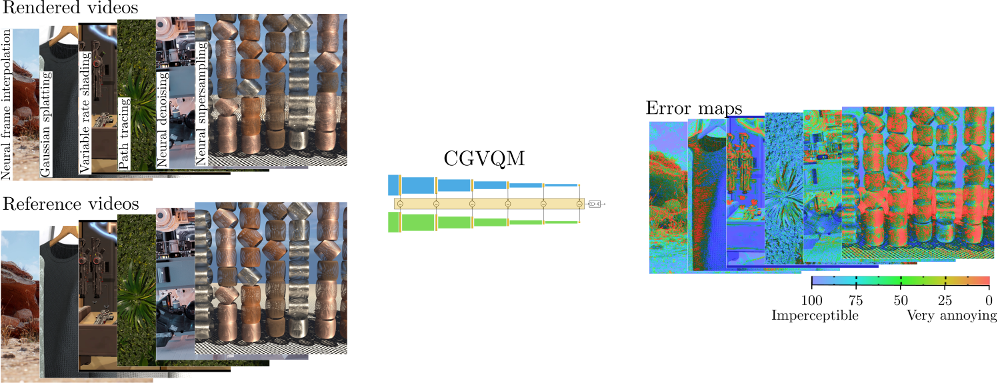

# CGVQM: Computer Graphics Video Quality Metric
[](https://github.com/IntelLabs/cgvqm/code/main/LICENSE)
[](https://scorecard.dev/viewer/?uri=github.com/IntelLabs/cgvqm)
[](https://pytorch.org/get-started/locally/)


[Paper](http://arxiv.org/abs/2506.11546) | [Blog](https://community.intel.com/t5/Blogs/Tech-Innovation/Client/Assessing-Video-Quality-in-Real-time-Computer-Graphics/post/1694109) | [Dataset](https://github.com/IntelLabs/CGVQM) (Coming Soon...)


<br /><br />

**CGVQM** is a *full-reference* video quality metric that predicts perceptual differences between pairs of videos.  
Like PSNR and SSIM, it compares a **ground-truth reference** to a **distorted** version (e.g. blurry, noisy, aliased).  

What sets CGVQM apart is that it is the first metric **calibrated for distortions from advanced rendering techniques**, accounting for both **spatial** and **temporal** artifacts.

### Features

- 📊 **Calibrated** on our [**CGVQD** dataset](https://github.com/IntelLabs/CGVQM), capturing complex artifacts from modern computer graphics.
- 🎚️ Outputs on an **interpretable perceptual scale** (e.g. *imperceptible* → *annoying*).
- 🗺️ Provides **error maps** to visualize *where* and *why* errors occur — not just a single score.
- 🖼️ Robust across a wide variety of content: from **stylized fantasy** to **photorealistic open worlds**, and across many rendering techniques.

CGVQM is implemented in **PyTorch**, optimized for **CUDA GPUs** (CPU also supported). See below for installation and usage instructions.

More details on the metric and dataset can be found in our paper:

```
@article{10.1111:cgf.70221,
journal = {Computer Graphics Forum},
title = {{CGVQM+D: Computer Graphics Video Quality Metric and Dataset}},
author = {Jindal, Akshay and Sadaka, Nabil and Thomas, Manu Mathew and Sochenov, Anton and Kaplanyan, Anton},
year = {2025},
publisher = {The Eurographics Association and John Wiley & Sons Ltd.},
ISSN = {1467-8659},
DOI = {10.1111/cgf.70221}
}
```

If you use the metric or the dataset in your research, please cite the paper above. 

## Quickstart
1. Obtain the CGVQM codebase, by cloning the repository:
```bash
git clone git@github.com:IntelLabs/cgvqm.git   # skip if a .zip is provided or you use Github GUI
```

2. Begin by installing the appropriate version of PyTorch (with CUDA support if available) using <a href="https://pytorch.org/get-started/locally/">os-specific instructions</a>. Install other requirements:
```bash
pip install numpy scipy av
```

3. After installation, run `python cgvqm.py`. This script provides a demo usage of CGVQM by comparing <i>'media/Dock_dist.mp4'</i> with <i>'media/Dock_ref.mp4'</i>. Adjust the configuration in `demo_cgvqm()` function according to your use case.

4. A sample training script is provided in `train.py` to calibrate the metric on datasets of your choice.
